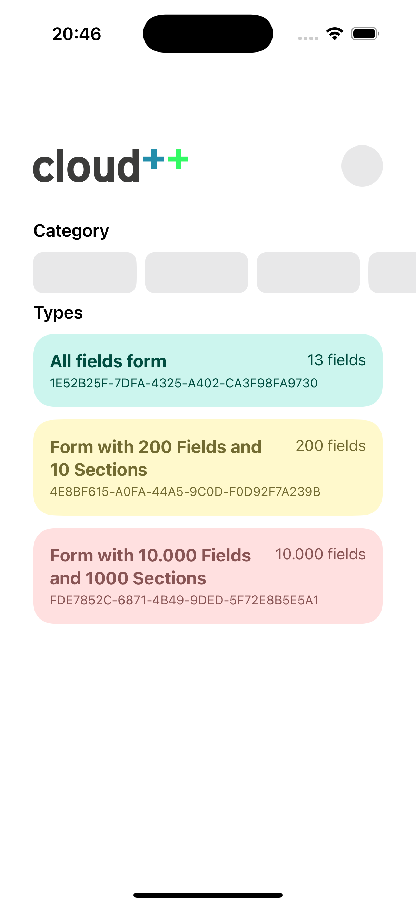
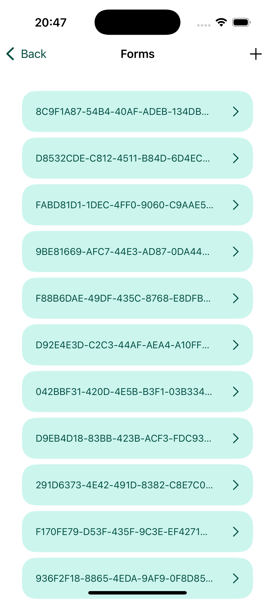
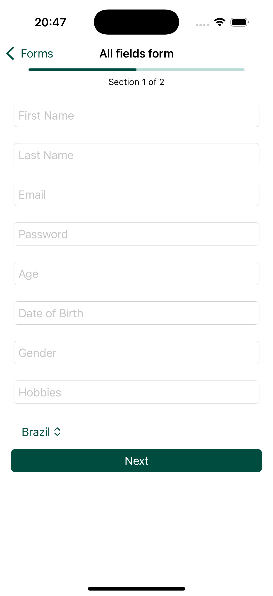
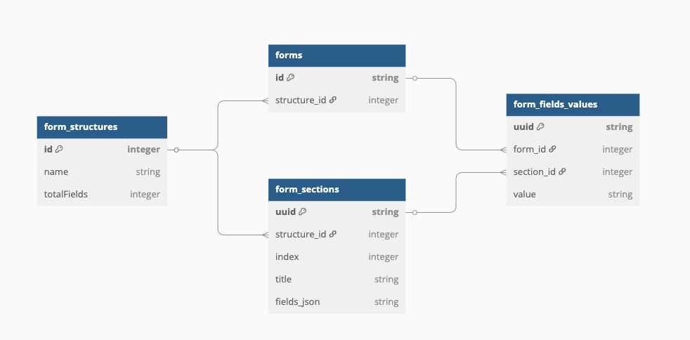

# Dynamic Form Project

This project shows a list of form structures, displays forms based on those structures, and loads form sections dynamically.

## Images

### Screenshots

  
  
  

### Database

## Features

- List of form structures  
- List of forms for each structure  
- Dynamic loading of forms with sections and fields
- Autosave 

## How It Works

- You select a form structure from a list  
- Then you see all forms created for that structure  
- When you open a form, it loads all sections and fields dynamically from JSON
  
## Could Do Better

- Implement error screens or messages  
- If I had more time, I would think more about the database schema  
- Add proper database migrations  
- Add validations for required fields  
- Improve UI components  

## Getting Started

1. Clone the project  
2. Android:
    - Open Android Studio
    - Click on Open Button
    - Make sure you select the `Android`
    - Wait gradle sync
3. iOS:
    1. Open the `iOS/CloudPlusPlus.xcodeproj` with Xcode
4. Run on a device or emulator
